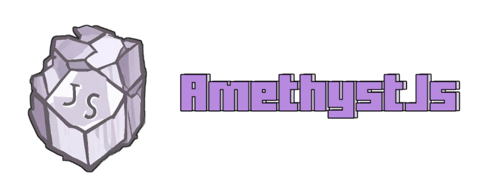

# AmethystJs
### Minecraft Bedrock scripting api wrapper 
---

### Introduction

> **Q:** What is this?
```
AmethystJs is an additional layer
to the Minecraft Bedrock scripting api
said additional layer has a modules system
in addition to containing 3 native modules
```

> **Q:** Is it compatible with vanilla scripting api?
```
Yes, AmethystJs is compatible with the
vanilla Scripting API, in fact the idea of
AmethystJs is that you can migrate an
advanced project over time
```
---

### How to start 

> **1.** Syntax
##### AmethystJs runs in an async function that runs itself
```js
// Import "require" function
import { require } from 'BPM/.js'

(async () => {
    // Modules
    const { World } = await require('@core'); // or "const core = await require('@core');"
    // Code
    World.print('hello world :p');
})();
```

> **2.** Event 
##### `Event` object from @core native module
```js
import { require } from 'BPM/.js'

(async () => {
    const { Event } = await require('@core');

    // Event follow
    Event.follow('before/chatSend',ev => {});
    Event.follow('after/itemUse',ev => {});
    // Event shortcurt (place, break, spawn and die)
    Event.follow('spawn::shulker', ev => {});
    // Multiple parameters
    Event.follow('spawn::shulker&iron_golem&...', ev => {});
})();
```
> **3.** World
##### `World` object from @core native module
```js
import { require } from 'BPM/.js'

(async () => {
    const { World } = await require('@core'); 

    World.print('hello world :p');
    World.ephemeral('Shh',player);
    World.command('run::say hi');
    World.command('async::say hi');
})();

```
